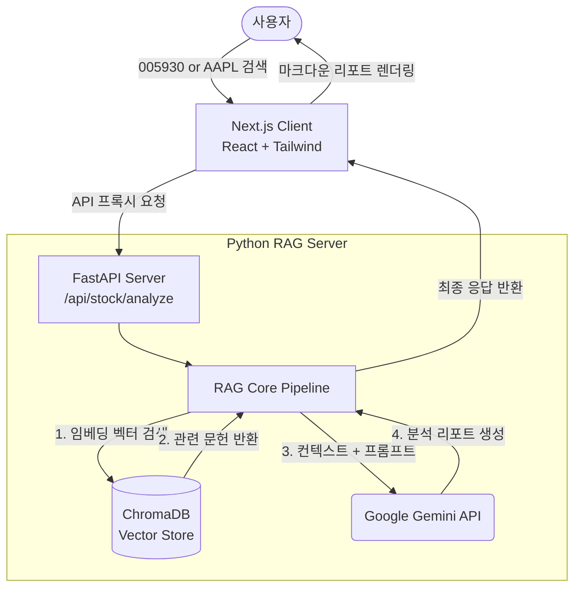

# 📈 AI Stock Analysis RAG System
> **Next.js + FastAPI 기반의 지능형 주식 분석 플랫폼**

사용자가 관심 있는 한국(KRX) 및 미국(US) 주식 종목을 검색하면, 해당 종목의 최신 뉴스 기사를 **Vector DB(ChromaDB)** 에서 검색한 후 **Google Gemini LLM**이 종합적인 투자 분석 리포트를 생성해주는 RAG(Retrieval-Augmented Generation) 시스템입니다.

---

## 🏗 전체 아키텍처



## 🛠 기술 스택

| 영역 | 기술 | 역할 |
|------|------|------|
| **Frontend** | Next.js (App Router), Tailwind CSS, Framer Motion | 사용자 UI, 마크다운 렌더링, 서버 프록시 라우트 |
| **Backend** | Python 3.11+, FastAPI, Pydantic | RAG 파이프라인 구축 및 독립형 API 엔드포인트 |
| **Vector DB** | ChromaDB | 수집된 뉴스 기사의 벡터 임베딩 저장 및 유사도 검색 |
| **LLM & Embedding** | Google Gemini (models/embedding-001, gemini-2.0-flash) | 텍스트 임베딩 생성 및 심층 분석 리포트 요약 생성 |
| **패키지 관리** | pnpm (Web), uv (Python) | 빠르고 결정론적인 의존성 패키지 관리 |

---

## 🚀 로컬 실행 방법 (Quick Start)

본 프로젝트는 프론트엔드(`apps/web`)와 백엔드(`apps/rag-server`) 모노레포 구조로 되어 있습니다. 정상적인 실행을 위해 아래 순서대로 각각 서버를 구동해야 합니다.

### 1️⃣ RAG 서버 환경 설정 및 실행 (Backend)

```bash
cd apps/rag-server

# 1. uv를 통한 파이썬 의존성 설치
uv sync

# 2. 환경변수 파일 복사 및 세팅
cp .env.example .env
```
> **⚠️ 중요:** `.env` 파일을 열고 발급받은 `GEMINI_API_KEY` 값을 반드시 입력해주세요.

```bash
# 3. FastAPI 서버 구동 (포트 8000)
uv run uvicorn app.main:app --reload --port 8000
```

### 2️⃣ 데이터 초기화 (Ingestion)
검색 기능을 테스트하기 전, VectorDB에 더미 뉴스 데이터를 밀어넣는 작업이 필요합니다. (API 서버가 실행된 상태에서 새 터미널 창을 열어주세요.)

```bash
# 한국 주식 데이터 수집 (예시: 삼성전자)
curl -X POST http://localhost:8000/api/stock/ingest -H "Content-Type: application/json" -d '{"ticker": "005930", "market": "KRX"}'

# 미국 주식 데이터 수집 (예시: 애플)
curl -X POST http://localhost:8000/api/stock/ingest -H "Content-Type: application/json" -d '{"ticker": "AAPL", "market": "US"}'
```

### 3️⃣ Next.js 프론트엔드 실행 (Frontend)

```bash
cd apps/web

# 1. 의존성 패키지 설치
pnpm install

# 2. 프론트엔드 개발 서버 구동 (포트 3000)
pnpm dev
```
👉 브라우저에서 **[http://localhost:3000](http://localhost:3000)** 에 접속하여 `005930` 이나 `AAPL` 종목을 검색해보세요.

---

## 🗂 프로젝트 폴더 구조

```text
├── apps/
│   ├── web/                     # ⚛️ Next.js 웹 애플리케이션 (Frontend)
│   │   ├── src/app/             # App Router 마이그레이션 적용 및 서버 액션
│   │   └── src/components/      # 공통 UI 컴포넌트 (검색바, 분석 카드 등)
│   │
│   └── rag-server/              # 🐍 Python RAG 전용 서버 (Backend)
│       ├── app/api/routes       # FastAPI 라우터 및 스키마
│       ├── app/core             # 임베딩 생성 및 RAG 파이프라인 제어
│       └── app/services         # 외부 통신 (LLM, VectorDB, News API) 연동
└── README.md                    # 프로젝트 가이드
```
